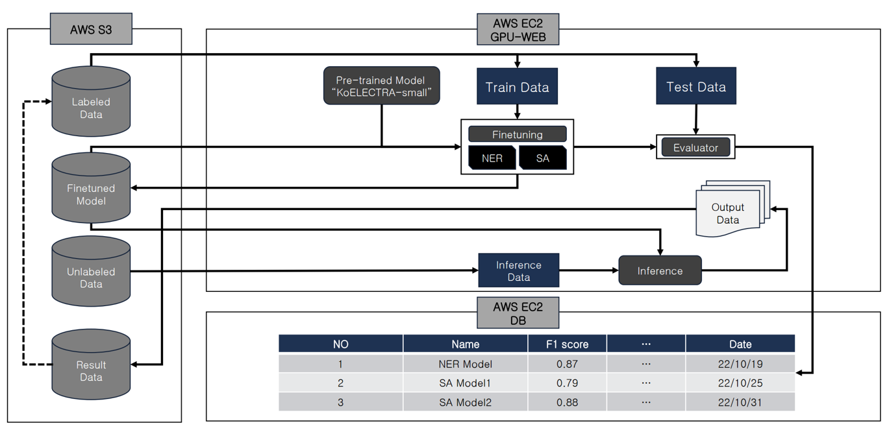
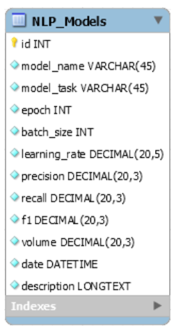
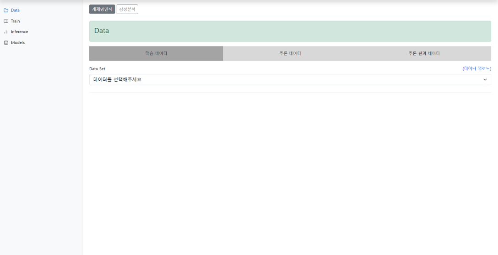
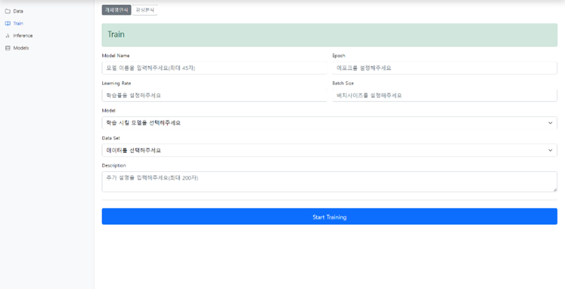
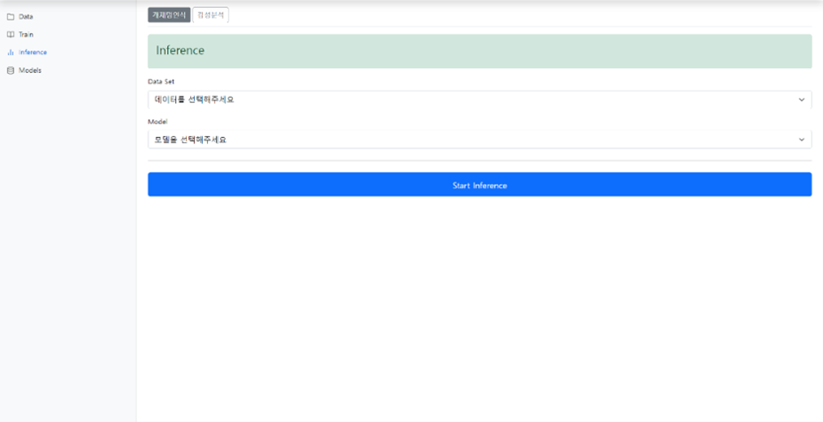
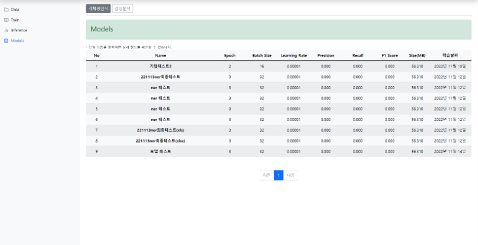

# SKKU Collaborative Project
2022학년도 성균관대학교 산학협력프로젝트

</br>

## Project
### Task
딥러닝 기반의 텍스트 마이닝 기술 개발 및 Django 기반 학습 구축 도구 개발
### Duration
2022.04 ~ 2022.12
### Members
|최진우|권동욱|류도현|김도현|허지원|
|:---:|:---:|:---:|:---:|:---:|
|성균관대학교 소프트웨어학과 3학년|성균관대학교 소프트웨어학과 3학년|성균관대학교 소프트웨어학과 3학년|성균관대학교 소프트웨어학과 2학년|성균관대학교 소프트웨어학과 2학년|

### About
자연어처리(감성분석, 개체명인식) 모델의 학습을 지속적으로 진행하며 추론을 진행할 수 있는 웹 프로젝트입니다


- System Architecture



AWS EC2에서 S3에 있는 모델과 학습 데이터를 불러와 파인 튜닝을 진행하고 성능이 향상된 모델을 다운하거나 S3에 다시 업로드하여 지속적인 관리가 가능한 시스템입니다.

- Database



각 모델의 Task, Metric, 크기, 학습 날짜 등은 1:1 맵핑이 되므로 
별도의 테이블을 생성할 필요가 없었습니다. 따라서 Single table로 모델의 정보를 관리하였습니다.

- Functionality



학습, 추론, 추론 결과 데이터를 관리하는 페이지입니다.



모델을 Matric을 설정하여 학습할 수 있습니다.



모델을 통해 Inference를 진행합니다. 결과 파일은 S3에 업로드됩니다.



모델 학습 이력을 관리하는 페이지입니다.

</br>

## Installation
### Clone
``` bash
$ git clone https://github.com/c-jinwoo/collab_project.git
$ cd collab_project
```
### Requirements
``` bash
$ pip install -r requirements.txt
```

## Stacks

### Environment


### Framework


### Development


### Machine Learning


### Cloud


### Communication


